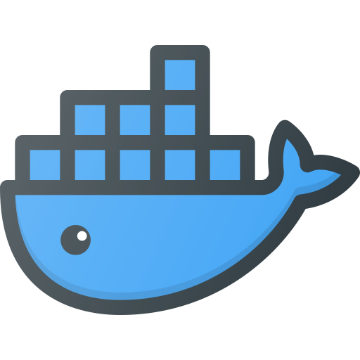

### Hi there 👋
I am a software developer and architect by profession. 
<!--
**eratnch/eratnch** is a ✨ _special_ ✨ repository because its `README.md` (this file) appears on your GitHub profile.
-->

## 🔭 I’m currently working on 
- All things 
- [Kubernetes-sig-cluster-api](https://github.com/kubernetes-sigs/cluster-api) based projects
- Openstack, Azure and GCP
- 

## 🌱 I’m currently learning 
- Golang
- Ansible
- Kubernetes

## 👯 I’m looking to collaborate on 
- opensource kubernetes projects

## 💬 Ask me about 
- k8s
- cluster-api
- openstack 
- azure 
- :cloud: computing and 

## 📫 How to reach me: ...

## ✍ Latest Blog Posts

## ⚡ Fun fact:

